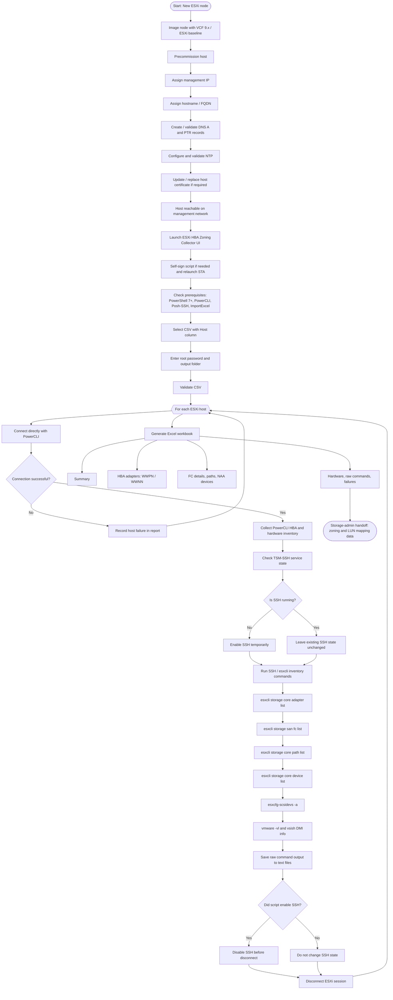

# VCF-9-ESX-Precommissioning-HBA-Zoning-Report-Bulk-Hosts
VCF 9 ESX Precommissioning HBA Zoning Report Bulk Hosts
# ESXi HBA Zoning Collector UI

A PowerShell 7 WPF utility for collecting Fibre Channel HBA, WWPN/WWNN, storage path, NAA/device, hardware, and raw ESXi command inventory from a CSV list of ESXi hosts. The output is a multi-sheet Excel workbook intended for storage administrator zoning and LUN-mapping handoff.

> Production script: `ESXi_HBA_Zoning_Collector_UI_v1.4_Production.ps1`

## What this tool does

- Reads a CSV file containing ESXi hostnames or IP addresses.
- Prompts for the ESXi `root` password in the UI.
- Connects directly to each ESXi host with PowerCLI.
- Enables SSH only when required for remote ESXi command collection.
- Disables SSH at the end only if the script enabled SSH.
- Collects PowerCLI HBA and hardware data.
- Runs ESXi storage inventory commands over SSH.
- Exports an Excel workbook with storage-team-friendly worksheets.
- Preserves large WWN decimal values as text so Excel does not show scientific notation such as `2.37817E+18`.
- Saves full raw command output as `.txt` files in the run folder.

## Prerequisites

- PowerShell 7+
- Windows host capable of WPF / STA execution
- `VCF.PowerCLI` or `VMware.PowerCLI`
- `Posh-SSH`
- `ImportExcel`
- Network access to ESXi management interfaces
- ESXi `root` credentials

The UI includes a prerequisite checker and an **Install Missing Modules** button.

## CSV format

```csv
Host
10.10.50.101
10.10.50.102
esxi-hostname.domain.local
```

The default host column is `Host`. The UI also accepts `Hostname`, `IP`, or `FQDN` when the default column is not present.

## Run command

```powershell
pwsh -NoProfile -ExecutionPolicy Bypass -STA -File .\ESXi_HBA_Zoning_Collector_UI_v1.4_Production.ps1
```

## Excel output

The generated workbook includes these sheets:

- `Summary`
- `HBA_Adapters_PowerCLI`
- `Adapter_List_esxcli`
- `FC_Details`
- `Storage_Paths`
- `Storage_Devices_NAA`
- `Hardware`
- `Raw_Commands`
- `Failures`

## Precommissioning and collection flow



## Diagram PNG

A rendered PNG version of the flow is included with this repository as:

```text
ESXi-HBA-Zoning-Collector-Flow.png
```

## Notes for storage administrators

Use the colon-separated `WWPN` and `WWNN` fields for zoning wherever possible. Decimal WWN fields are retained for compatibility and are exported as text to prevent Excel from rounding or displaying scientific notation.
